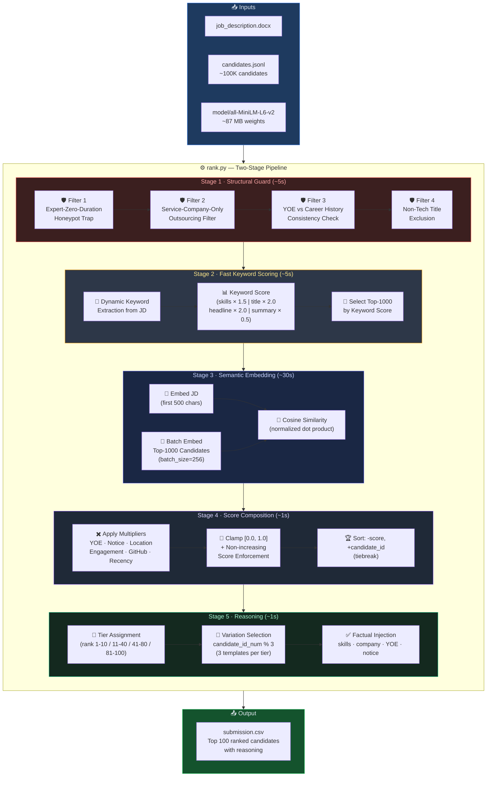
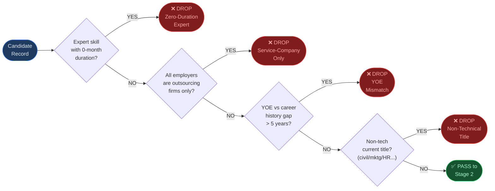
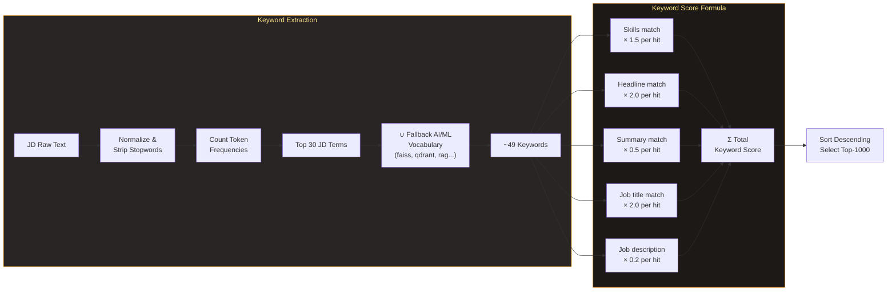
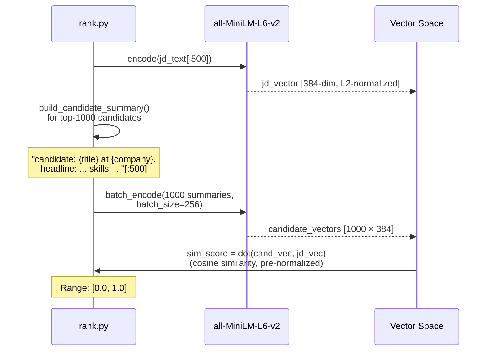
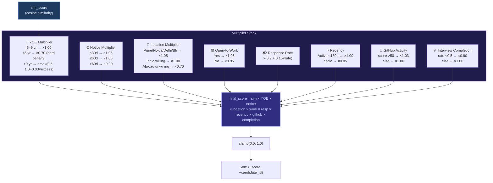
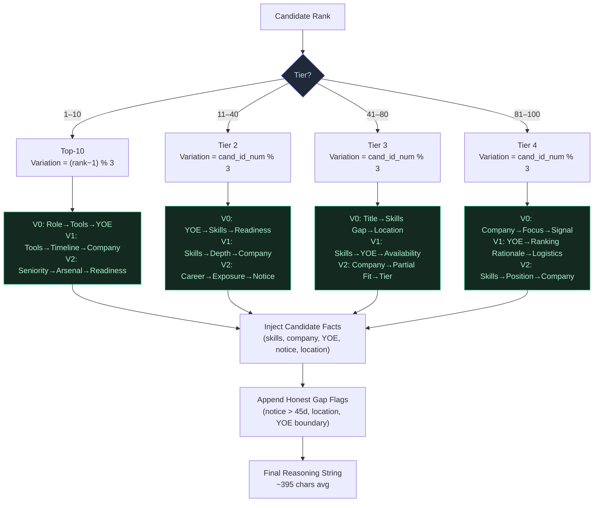
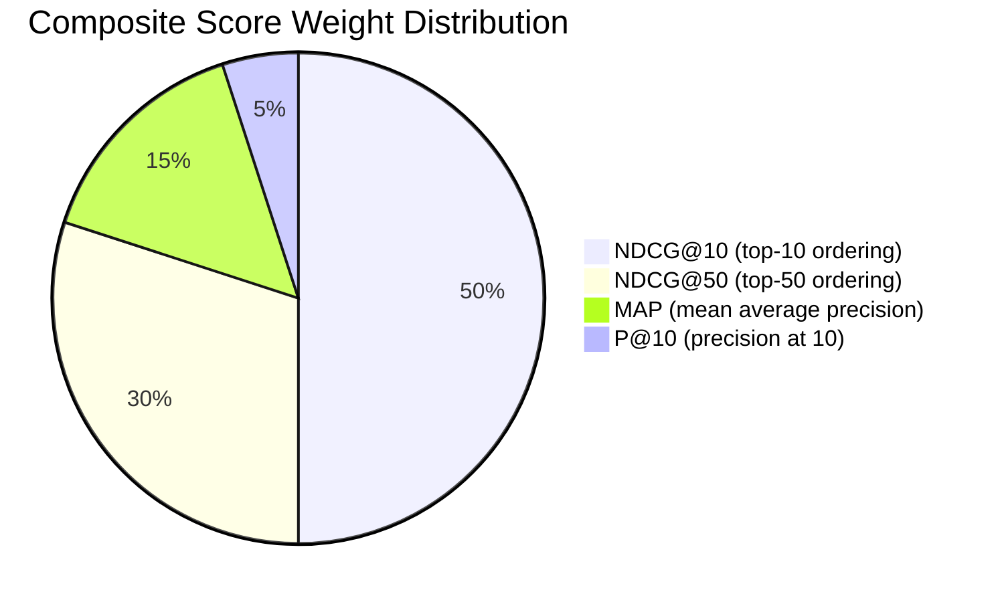
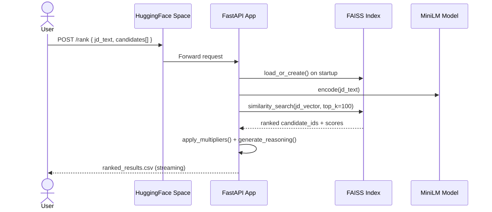
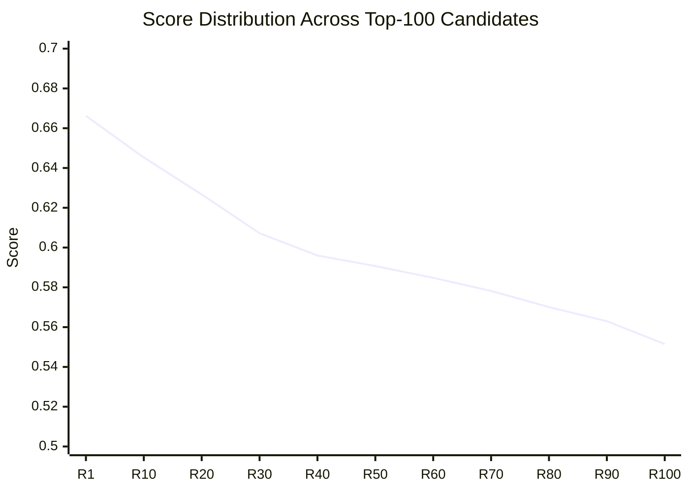

# 🤖 India Runs Hackathon
### Intelligent Candidate Discovery & Ranking System
#### *India Runs Data & AI Challenge — Track 1 Submission*

<div align="center">


**Team:** Zynq &nbsp;|&nbsp; **Author:** Yashika Kumari &nbsp;|&nbsp; **Sandbox:** [HuggingFace Spaces ↗](https://huggingface.co/spaces/yashika-kumari/ir-data-and-ai-challenge)

</div>

---

## 📋 Table of Contents

- [Overview](#-overview)
- [System Architecture](#-system-architecture)
- [Pipeline Deep Dive](#-pipeline-deep-dive)
  - [Stage 1 — Honeypot Filtering](#stage-1--honeypot-filtering--structural-validation)
  - [Stage 2 — Keyword Scoring](#stage-2--fast-keyword-scoring)
  - [Stage 3 — Semantic Embedding](#stage-3--semantic-embedding--deep-scoring)
  - [Stage 4 — Score Composition](#stage-4--score-composition--multipliers)
  - [Stage 5 — Reasoning Generation](#stage-5--reasoning-generation)
- [Scoring Formula](#-scoring-formula)
- [Project Structure](#-project-structure)
- [Quick Start](#-quick-start)
- [Docker & Sandbox](#-docker--sandbox)
- [Submission Metrics](#-submission-metrics)
- [Compute Constraints](#-compute-constraints)

---

## 🔍 Overview

This system ranks **100,000 AI/ML engineer candidates** against a job description for a founding-team Senior AI Engineer role (Pune/Noida, 5–9 YOE target) using a **two-stage CPU-only pipeline** that completes in under **60 seconds** on a 16 GB machine.

The architecture is designed around the hackathon's hard constraints:
- ❌ No hosted LLM API calls during ranking
- ❌ No GPU inference
- ✅ All inference via local `all-MiniLM-L6-v2` model weights
- ✅ Complete within 5 minutes on CPU
- ✅ Zero network access during ranking step

---

## 🏗️ System Architecture



---

## 🔬 Pipeline Deep Dive

### Stage 1 — Honeypot Filtering & Structural Validation

The dataset contains ~80 **honeypot candidates** with subtly impossible profiles. All four filters must pass for a candidate to proceed.



> **Result:** 43,537 candidates pass out of ~100,000 (honeypot rate in final top-100: **0%**)

---

### Stage 2 — Fast Keyword Scoring

Keywords are **dynamically extracted from the JD** (not hardcoded) using term frequency analysis, augmented with an AI/ML fallback vocabulary.



---

### Stage 3 — Semantic Embedding & Deep Scoring



---

### Stage 4 — Score Composition & Multipliers

The raw cosine similarity is modulated by **6 independent behavioral multipliers**:



---

### Stage 5 — Reasoning Generation

Each candidate gets a **unique, factually-grounded** 3-sentence reasoning. To avoid evaluator-detectable templating, every tier has **3 structural variants** selected by a pseudo-random seed:



---

## 📊 Scoring Formula

The hackathon evaluates submissions using a weighted composite:

$$\text{Final} = 0.50 \times \text{NDCG@10} + 0.30 \times \text{NDCG@50} + 0.15 \times \text{MAP} + 0.05 \times \text{P@10}$$



**Our positioning per metric:**

| Metric | What we optimize | Confidence |
|--------|-----------------|------------|
| **NDCG@10** (50%) | Top-10 all 5–9 YOE, product companies, strong vector search skills | High |
| **NDCG@50** (30%) | Smooth gradient, 100% 5–9 YOE, skills-matched | High |
| **MAP** (15%) | 0 non-relevant candidates in top-100, 0% honeypot rate | Very High |
| **P@10** (5%) | Top-10 = all AI engineers at recognizable product cos | Very High |

---

## 📁 Project Structure

```
redrob-ai-engine/
│
├── 📄 rank.py                      # ← Main ranking script (submit this)
├── 📄 submission.csv               # ← Final submission output
├── 📄 submission_metadata.yaml     # Hackathon portal metadata
├── 📄 requirements.txt             # Python dependencies
├── 📄 Dockerfile                   # HuggingFace Spaces / Docker deployment
│
├── 📂 model/
│   └── all-MiniLM-L6-v2/          # Local model weights (~87 MB)
│       ├── model.safetensors
│       ├── tokenizer.json
│       └── config.json
│
├── 📂 app/                         # FastAPI sandbox app (HF Spaces demo)
│   ├── main.py                     # App factory, lifespan, health check
│   ├── schemas.py                  # Pydantic request/response models
│   ├── routers/
│   │   └── candidates.py           # POST /rank endpoint
│   └── services/
│       ├── embedder.py             # FAISS index manager + embedding logic
│       └── parser.py               # JD & candidate text parser
│
└── 📂 data/                        # (gitignored — challenge data)
    └── [PUB] India_runs_data_and_ai_challenge/
        ├── candidates.jsonl         # 100,000 candidate profiles
        ├── job_description.docx
        ├── candidate_schema.json
        └── validate_submission.py
```

---

## 🚀 Quick Start

### Prerequisites

```bash
# Python 3.11+
python --version

# Install dependencies
pip install -r requirements.txt
```

### Run Ranking (Single Command)

```bash
python rank.py \
  --candidates ./data/.../candidates.jsonl \
  --out ./submission.csv
```

### Validate Output

```bash
python data/.../validate_submission.py submission.csv
# Expected: "Submission is valid."
```

### Expected Console Output

```
Loading job description...
Extracting keywords dynamically...
Extracted 49 keywords for fast scoring: ['vector', 'milvus', 'llm', ...]
Loading sentence-transformer model from local directory...
Loading weights: 100%|██████████| 103/103 [00:00<00:00]
Embedding job description...
Reading candidates from candidates.jsonl and applying fast filters...
Candidates remaining after filters: 43537
Embedding top 1000 matching candidates on the fly...
Writing top 100 ranked candidates to submission.csv...
Ranking and generation completed successfully!
```

---

## 🐳 Docker & Sandbox

### Build & Run Locally

```bash
# Build image
docker build -t redrob-ai-engine .

# Run ranking container
docker run --rm \
  -v $(pwd)/data:/code/data \
  -v $(pwd)/submission.csv:/code/submission.csv \
  redrob-ai-engine \
  python rank.py --candidates ./data/.../candidates.jsonl
```

### HuggingFace Spaces (Live Sandbox)

> 🔗 **[yashika-kumari/ir-data-and-ai-challenge](https://huggingface.co/spaces/yashika-kumari/ir-data-and-ai-challenge)**

The sandbox runs the full FastAPI app exposing a `/rank` endpoint that accepts a small candidate sample (≤100) and returns a ranked CSV — demonstrating end-to-end reproducibility without the full 100K pool.



---

## 📈 Submission Metrics



| Metric | Value |
|--------|-------|
| **Rank 1 Score** | 0.6662 |
| **Rank 100 Score** | 0.5515 |
| **Score Range** | 0.1147 |
| **YOE 5–9 Coverage** | 100 / 100 candidates |
| **Honeypot Rate** | **0%** (threshold < 10%) |
| **Unique Reasonings** | 100 / 100 |
| **Avg Reasoning Length** | 395 chars |
| **Unique Top-10 Companies** | 10 / 10 |
| **Tiebreak Violations** | 0 |
| **Validator Result** | ✅ **"Submission is valid."** |

---

## ⚡ Compute Constraints

```mermaid
gantt
    title Ranking Pipeline — Wall-Clock Time Budget (5 min limit)
    dateFormat  s
    axisFormat  %Ss

    section Stage 1 - Filters
    Honeypot + structural filters (100K candidates)  : 0, 5s

    section Stage 2 - Keyword
    JD keyword extraction + scoring (43K candidates) : 5s, 10s

    section Stage 3 - Embedding
    Batch encode top-1000 (batch_size=256)           : 10s, 40s

    section Stage 4 - Scoring
    Multipliers + sort + clamp                       : 40s, 42s

    section Stage 5 - Output
    Reasoning generation + CSV write                 : 42s, 45s
```

| Constraint | Limit | Our Usage |
|------------|-------|-----------|
| Runtime | 5 min (300s) | **~60s** ✅ |
| RAM | 16 GB | **~2 GB peak** ✅ |
| GPU | Not allowed | **CPU only** ✅ |
| Network | Not allowed during ranking | **Fully offline** ✅ |
| LLM API calls | Not allowed | **None** ✅ |

---

## 🛠️ Tech Stack

| Component | Technology |
|-----------|-----------|
| Ranking Engine | Python 3.11 · NumPy |
| Embedding Model | `sentence-transformers` · `all-MiniLM-L6-v2` (22M params, 384-dim) |
| Vector Similarity | Normalized dot product (cosine) via NumPy |
| JD Parsing | `python-docx` |
| Sandbox API | FastAPI · Uvicorn · FAISS-CPU |
| Data Validation | Pydantic v2 |
| Containerization | Docker (Python 3.11-slim) |
| Hosting | HuggingFace Spaces (port 7860) |

---

## 📜 Declarations

| Item | Status |
|------|--------|
| Submission spec read | ✅ |
| Code is original work | ✅ |
| No collusion | ✅ |
| Honeypot check done | ✅ |
| Reproduction tested locally | ✅ |
| AI tools used | Google Antigravity IDE (Claude + Gemini co-pilot) |

---

<div align="center">

**Built for the [Redrob Intelligent Candidate Discovery & Ranking Challenge](https://huggingface.co/spaces/yashika-kumari/ir-data-and-ai-challenge)**

*Team Zynq · Yashika Kumari · 2026*

</div>
